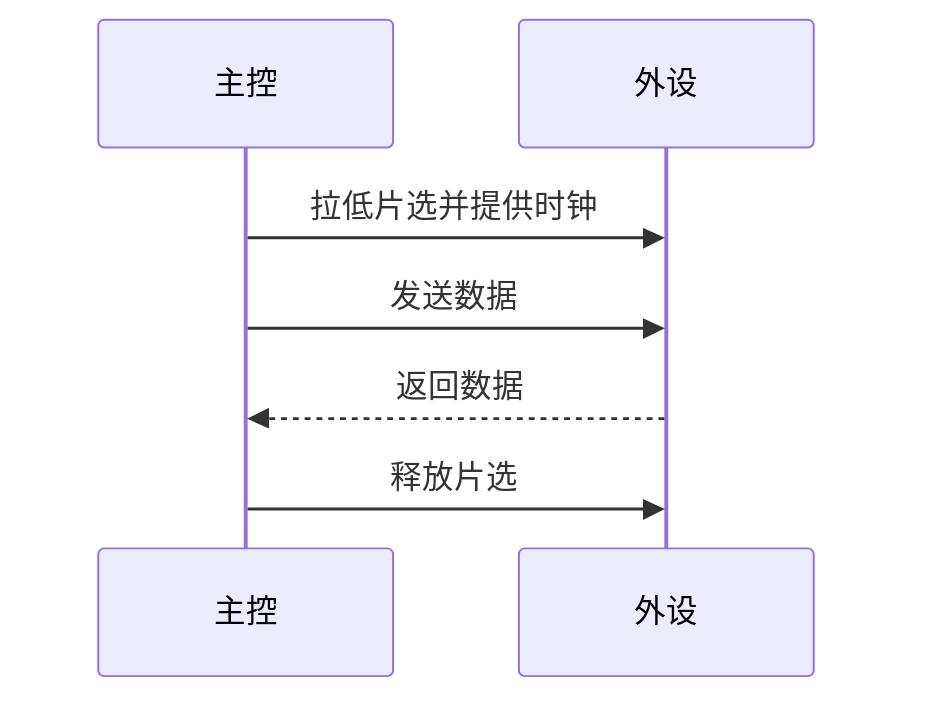

这是一篇功能示例笔记。完整写作与发布方法见 [[知识库使用指南]]。

## 基本概念

SPI 通信一般涉及时钟、数据和片选信号。实际接线、电压和工作模式应以设备手册为准。

## 时序图

```mermaid
sequenceDiagram
    participant M as 主控
    participant S as 外设
    M->>S: 拉低片选并提供时钟
    M->>S: 发送数据
    S-->>M: 返回数据
    M->>S: 释放片选
```

## 下一步

查看 [[图表与公式]]，了解文章中如何展示公式和流程图。
